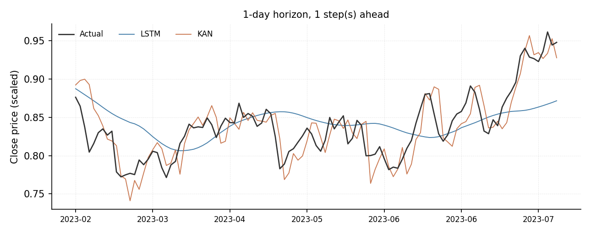
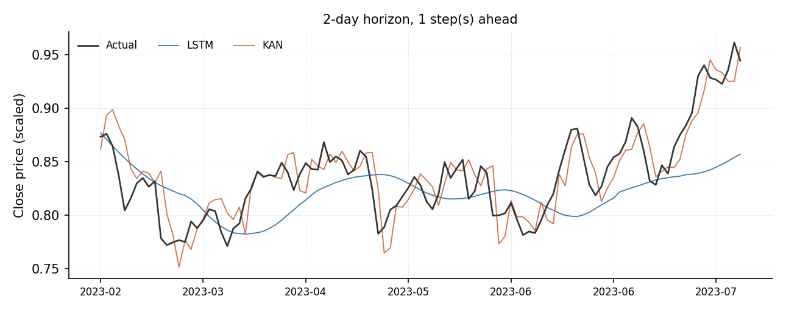
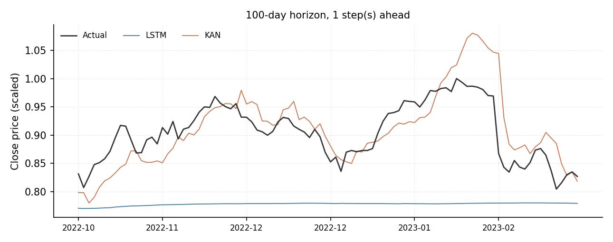
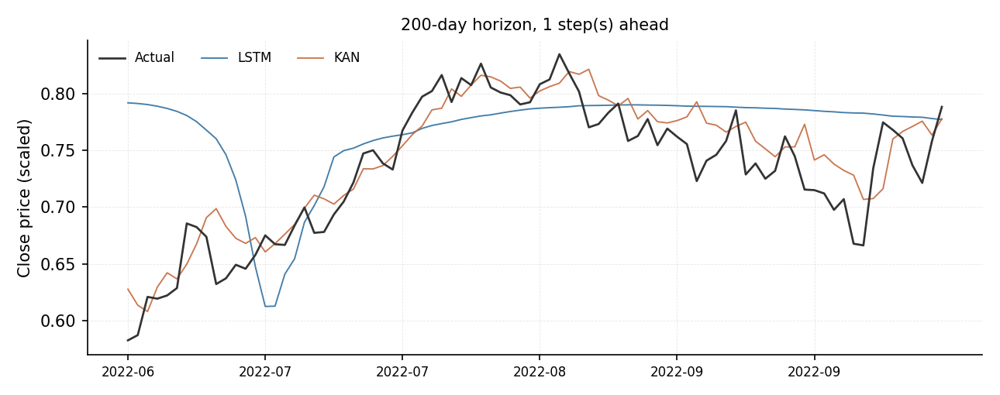
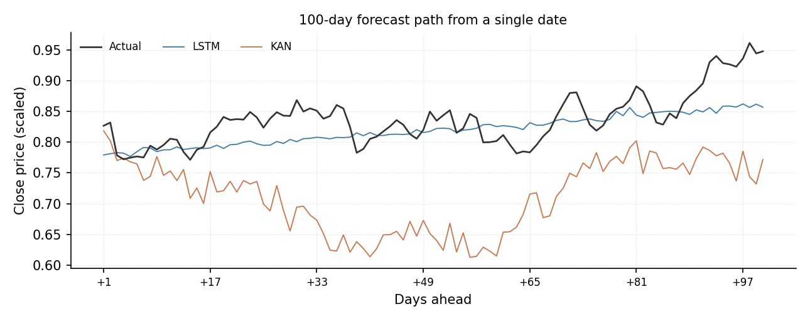
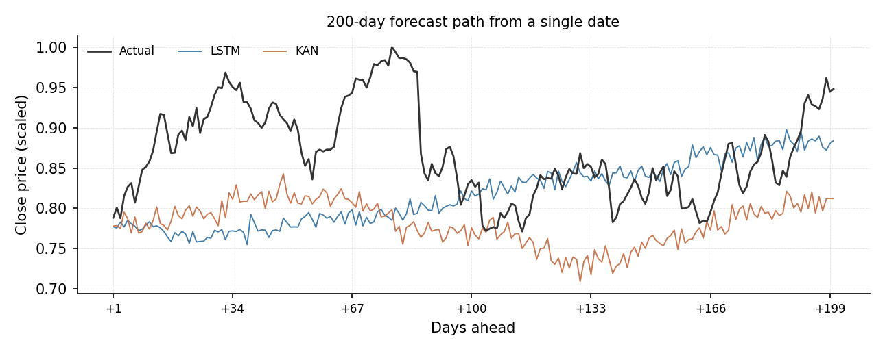

# What the forecast figures show

A short guide to the six plots in this folder. All prices are Min-Max scaled to
the range 0 to 1, so the numbers are not dollars. Lower error is better.

All figures use seed 0 and the final walk-forward test fold, which is the most
recent stretch of data the models had never seen.

---

## How to read these

There are two kinds of picture here, and they answer different questions.

**Step plots** fix one distance into the future and follow it through time.
"If the model predicts one day ahead, how well does it do, day after day?"
The black line is what actually happened; the coloured lines are the forecasts.

**Trajectory plots** freeze one date and show the whole forecast path from it.
"Standing on this day, what did each model think the next hundred days would
look like?"

Step plots are for comparing models. Trajectory plots reveal how a model
behaves when it is asked to see a long way ahead.

---

## 1. One day ahead

Line error: KAN 0.024, LSTM 0.039.

Both models stay close to the actual price, which is unsurprising, since
tomorrow's price is usually near today's. The KAN follows the daily wiggles
more closely. The LSTM is smoother and tends to arrive at each turn slightly
late.

---

## 2. Two days ahead

Line error: KAN 0.021, LSTM 0.040.

This is the clearest of the six. The KAN tracks the real movement, including
the sharp falls in mid February and early June. The LSTM has effectively drawn
a smooth average through the data: it captures the general shape but misses
almost every turning point, and from late June it drifts well below the actual
price as the market climbs.

If one figure had to demonstrate that the two models do not perform as
previously reported, this is the one.

---

## 3. One hundred days ahead

Line error: KAN 0.043, LSTM 0.137.

The same comparison, but now each forecast is made one hundred days in advance.
Both models are visibly further from the truth. The LSTM sits noticeably above
the actual price for much of the period.

---

## 4. Two hundred days ahead

Line error: KAN 0.026, LSTM 0.068.

At this distance neither model has much real information to work with. The
lines stay within a narrow band while the actual price moves around them.

---

## 5. A single hundred-day forecast path

This freezes one date and plots what each model expected over the following one
hundred days.

The LSTM produces an almost flat line with a slight upward drift. It has
essentially learned the average price level and predicts that, rather than any
movement. The KAN swings well below the real price for the middle stretch
before recovering.

Two quite different ways of being wrong, and neither is visible in an error
table.

---

## 6. A single two-hundred-day forecast path

The most honest picture in the set. The actual price rises to the top of its
range around day 75 and swings considerably. Both forecasts stay inside a
narrow band for the entire two hundred days, drifting gently.

Neither model is predicting the future here. Both have learned roughly where
the price tends to sit and little else.

---

## The short version

- At short horizons the KAN follows real movement more closely; the LSTM
  smooths it away.
- Errors grow with distance for both, as expected.
- At long horizons neither model forecasts in any meaningful sense. They settle
  near an average and stay there.

**One caution.** Figures 5 and 6 each show a single starting date, so they
illustrate behaviour rather than prove it. The errors quoted for them apply to
that one path and will not match the pooled figures in the paper's tables. Use
them to show *how* the models behave, not *how well*.

---

## Regenerating these

All six come from `make_figure.py` in the folder above. Change the settings at
the top of that file and run it. Each run writes a `.png` for viewing and a
`.tex` version for the paper.
